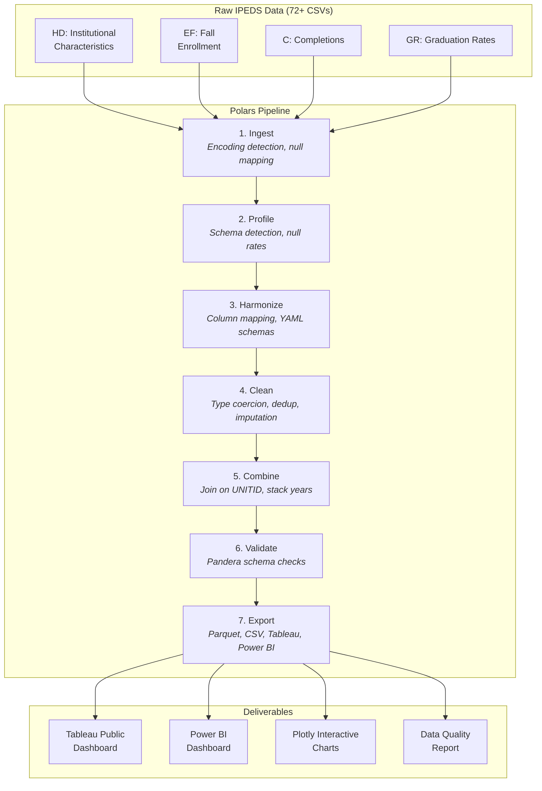

# IPEDS Higher Education Data Pipeline & Dashboard


A production grade data pipeline that ingests, harmonizes, and visualizes **6 years of IPEDS survey data** (2018–2024) covering **~6,400 US postsecondary institutions**. Demonstrates handling real world data challenges: inconsistent schemas across years, mixed data types, and multiple missing data encodings.

## The Problem

[IPEDS](https://nces.ed.gov/ipeds/) is the primary source of US higher education data, but working with it is notoriously painful:

- **72+ CSV files** across 6 years and 4 survey components
- Column names **change between years** (e.g., `EFRACE01` → `EFRACE15`)
- Data types are **inconsistent** (institution IDs as integers in some files, strings in others)
- Missing data is coded **differently across years** (`-1`, `-2`, `.`, empty string, `NULL`)
- Survey components must be **joined on UNITID** and stacked across years

This pipeline solves all of that and produces clean, analysis ready datasets for Tableau, Power BI, and Python visualizations.

## Architecture



## Key Metrics

| Metric | Value |
|--------|-------|
| Raw files ingested | 72+ CSVs |
| Institutions covered | ~6,400 per year |
| Survey years | 2018–2024 |
| Schema conflicts resolved | _TBD_ |
| Final dataset dimensions | _TBD_ |

## Tech Stack

| Layer | Technology |
|-------|-----------|
| Data Processing | Polars 1.38+ |
| Data Validation | Pandera 0.29+ (Polars backend) |
| Analytics Engine | DuckDB 1.2+ |
| Visualization (Python) | Plotly, Seaborn |
| Visualization (BI) | Tableau Public, Power BI Desktop |
| Export Formats | Parquet (zstd), CSV |
| Package Manager | uv |
| CI/CD | GitHub Actions |
| Linting | ruff |
| Testing | pytest |

## Quick Start

### Prerequisites

- Python 3.12+
- [uv](https://docs.astral.sh/uv/) (Python package manager)
- Tableau Public (free) and/or Power BI Desktop (free)

### Setup

```bash
cd 01-ipeds-pipeline-dashboard
make setup
# Download IPEDS data (see data/README.md for instructions)
# Place CSV files in data/raw/
make all
```

### Individual Pipeline Stages

```bash
make ingest      # Read raw CSVs with encoding detection
make profile     # Auto detect schemas, compute null rates
make harmonize   # Map columns to canonical names across years
make clean       # Type coercion, null handling, deduplication
make combine     # Join components on UNITID, stack years
make validate    # Pandera schema validation
make export      # Export to Parquet, CSV, Tableau, Power BI
make viz         # Generate Plotly charts
make test        # Run pytest suite
make lint        # Run ruff linter + formatter check
```

## Dashboards

_Coming soon — dashboards will be embedded here with screenshots and Tableau Public links._

### Tableau Dashboard (Planned)
- Enrollment trends by institution type (2018–2024)
- Geographic distribution (choropleth by graduation rate)
- Completion rate heatmap by program area
- Tuition vs graduation rate scatter

### Power BI Dashboard (Planned)
- Executive KPI cards
- Drill down: institution type → state → individual institution
- Year over year growth with DAX measures

## License

MIT
