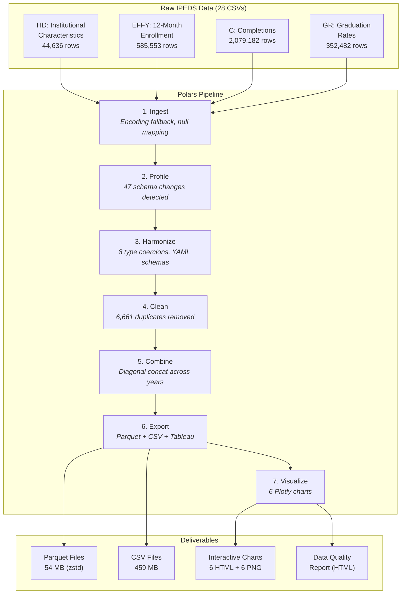
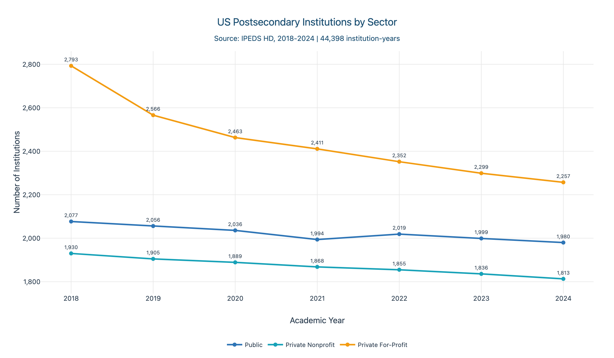
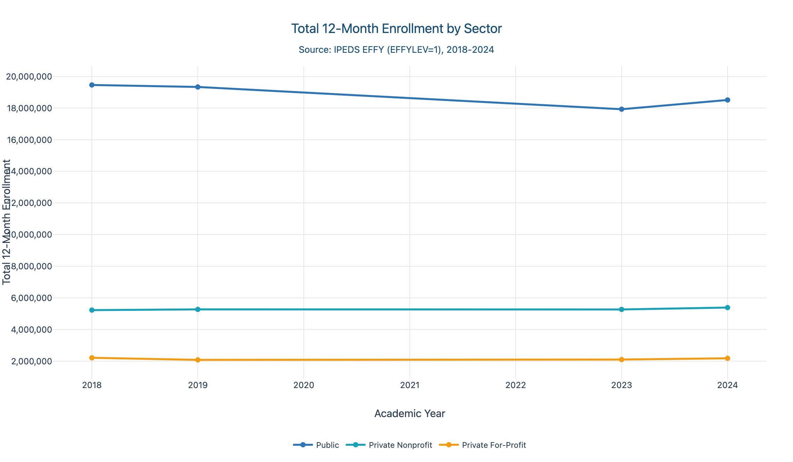
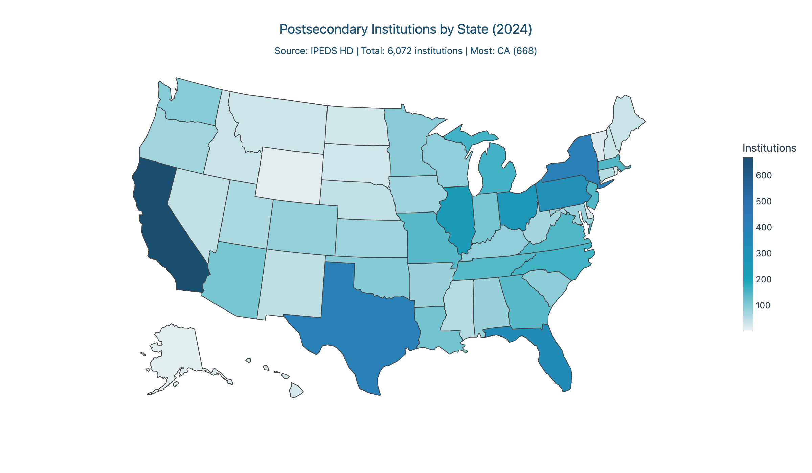
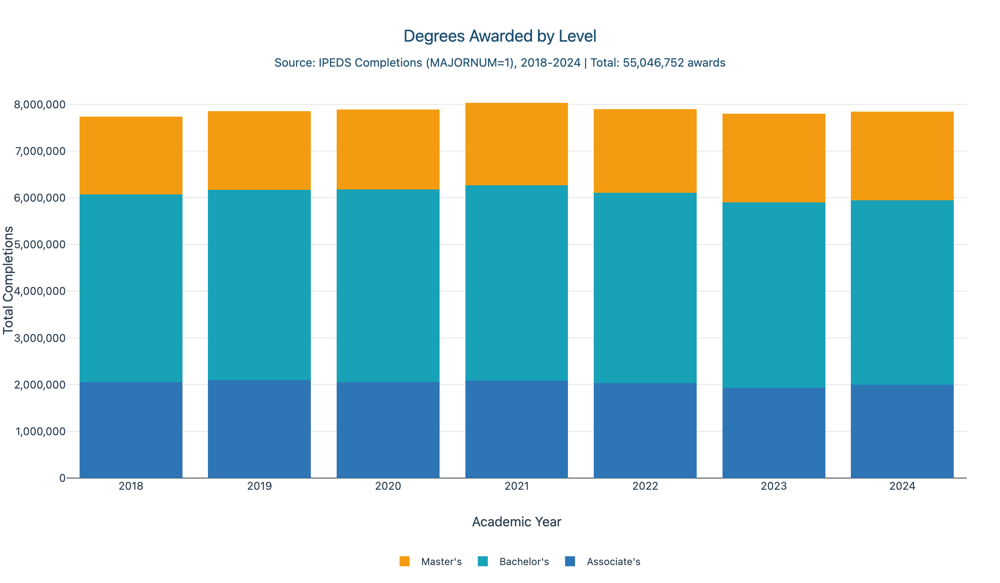
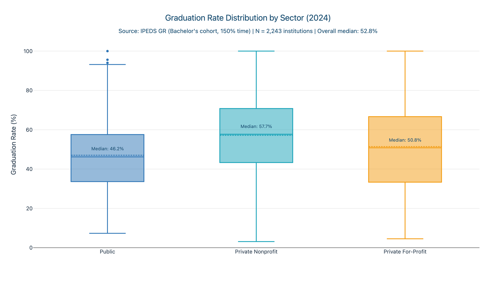
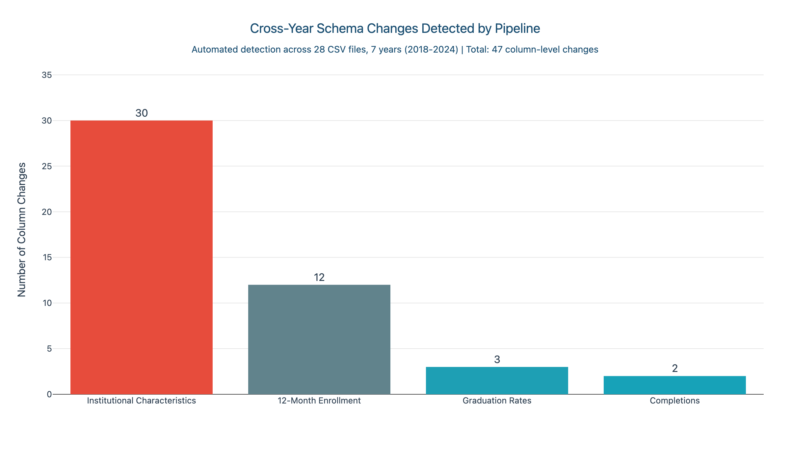

# IPEDS Higher Education Data Pipeline & Dashboard


A production grade data pipeline that ingests, harmonizes, and visualizes **7 years of IPEDS survey data** (2018-2024) covering **~6,400 US postsecondary institutions**. Demonstrates handling real world data challenges: inconsistent schemas across years, mixed data types, duplicate records, and multiple missing data encodings.

## Results at a Glance

| Metric | Value |
|--------|-------|
| Raw files ingested | **28 CSVs** across 4 survey components |
| Total rows processed | **3,055,192** |
| Schema changes detected | **47** column level changes across years |
| Type coercions applied | **8** (automatic Int64/String resolution) |
| Duplicate rows removed | **6,661** (from EFFY enrollment data) |
| Institutions covered | **~6,400** per year |
| Survey years | **2018-2024** |
| Export formats | Parquet (54 MB) + CSV (459 MB) + Tableau CSV |
| Visualizations generated | **6** interactive Plotly charts + PNGs |

## The Problem

[IPEDS](https://nces.ed.gov/ipeds/) is the primary source of US higher education data, but working with it is notoriously painful:

- **72+ CSV files** across 7 years and 4 survey components
- Column names **change between years** (e.g., Carnegie classification columns rotate as new schemes are published)
- Data types are **inconsistent** (`FIPS`, `OBEREG`, `OPEID`, `EFFYLEV`, `LSTUDY`, `GRTYPE` flip between Int64 and String)
- Missing data is coded **differently** (`-1`, `-2`, `.`, empty string, `NULL`)
- Some files have **trailing spaces in column names** (e.g., `EFYGUKN ` in 2022)
- **6,661 exact duplicate rows** in enrollment data across 3 years
- Survey components must be **joined on UNITID** and stacked across years

This pipeline detects and resolves all of these issues automatically.

## Architecture



## Visualizations

### 1. Institution Count Trends by Sector
Shows the decline in for-profit institutions and stability of public/private nonprofit sectors across 2018-2024.



### 2. Total Enrollment by Sector
12-month unduplicated enrollment trends revealing COVID-19 impact and recovery patterns.



### 3. Geographic Distribution
Choropleth map showing institutional density by state for the most recent year.



### 4. Completions by Award Level
Stacked bar chart of degrees and certificates awarded, broken down by level.



### 5. Graduation Rate Distribution
Box plots showing graduation rate spread across public, private nonprofit, and for-profit sectors.



### 6. Schema Changes Summary
Meta visualization showing the pipeline's own findings: 47 column level schema changes across components.



## Key Findings

**Schema Volatility:** Institutional Characteristics (HD) had 30 cross year column changes, the most of any component. Carnegie classification columns rotate as new classification schemes are published (C15BASIC/C18BASIC dropped in 2024, C00CARNEGIE added).

**Enrollment Data Restructure:** EFFY underwent a major schema change: 63 columns in 2018-2019, 64 in 2020-2021, and 72 in 2022-2024. Row counts jumped from ~14K to ~117K as IPEDS changed the reporting granularity.

**Data Quality Issues:** 6,661 exact duplicate rows found in EFFY data across 2019-2021. Type inconsistencies detected in 8 columns where numeric codes were sometimes parsed as strings.

**Completions Stability:** The C (Completions) component is remarkably stable at exactly 64 columns and 0.0% null rate across all 7 years.

## Tech Stack

| Layer | Technology | Version |
|-------|-----------|---------|
| Data Processing | Polars | 1.38+ |
| Data Validation | Pandera (Polars backend) | 0.29+ |
| Analytics Engine | DuckDB | 1.2+ |
| Visualization | Plotly | 6.0+ |
| Static Figures | Seaborn + Matplotlib | Latest |
| Export Formats | Parquet (zstd), CSV | - |
| Package Manager | uv | Latest |
| CI/CD | GitHub Actions | - |
| Linting | ruff | 0.9+ |
| Testing | pytest | 8.3+ |

## Quick Start

### Prerequisites

- Python 3.12+ (not 3.14)
- [uv](https://docs.astral.sh/uv/) (Python package manager)

### Setup

```bash
cd 01-ipeds-pipeline-dashboard
make setup                    # Install all dependencies via uv
```

### Download IPEDS Data

See [data/README.md](data/README.md) for step by step download instructions. Place CSVs in `data/raw/`.

### Run the Full Pipeline

```bash
make process                  # Ingest -> Profile -> Harmonize -> Clean -> Combine -> Export
make viz                      # Generate all visualizations
make test                     # Run test suite
make lint                     # Check code quality
```

### Individual Pipeline Stages

```bash
make ingest      # Read 28 raw CSVs with encoding detection
make profile     # Auto detect schemas, compute null rates
make harmonize   # Normalize columns, apply type coercions, generate YAML schemas
make clean       # Deduplicate, clean strings, process imputation flags
make combine     # Stack years via diagonal concatenation
make export      # Export to Parquet + CSV + Tableau optimized CSV
make viz         # Generate 6 Plotly charts (HTML + PNG)
```

## Repository Structure

```
01-ipeds-pipeline-dashboard/
├── README.md                      # This file
├── pyproject.toml                 # Dependencies + ruff config
├── Makefile                       # Pipeline automation (14 targets)
├── data/
│   ├── raw/                       # 28 IPEDS CSVs (gitignored)
│   ├── interim/                   # Schema comparisons, profiles
│   ├── processed/                 # Final Parquet + CSV exports
│   ├── schemas/                   # Auto generated YAML schemas
│   └── README.md                  # Download instructions
├── src/
│   ├── config.py                  # Paths, constants, theme
│   ├── ingest.py                  # CSV reading with encoding fallback
│   ├── profile.py                 # Schema detection, null analysis
│   ├── harmonize.py               # Column normalization, type coercion
│   ├── clean.py                   # Dedup, string cleaning
│   ├── combine.py                 # Diagonal concat across years
│   ├── export.py                  # Multi format export
│   ├── visualize.py               # 6 Plotly charts
│   ├── validate.py                # Pandera schema definitions
│   └── report.py                  # HTML data quality report
├── notebooks/                     # Jupyter EDA notebooks
├── dashboards/                    # Tableau + Power BI files
├── reports/                       # HTML reports + chart PNGs
├── tests/                         # pytest suite (22 tests)
└── tasks/                         # Task tracker + lessons learned
```

## License

MIT
