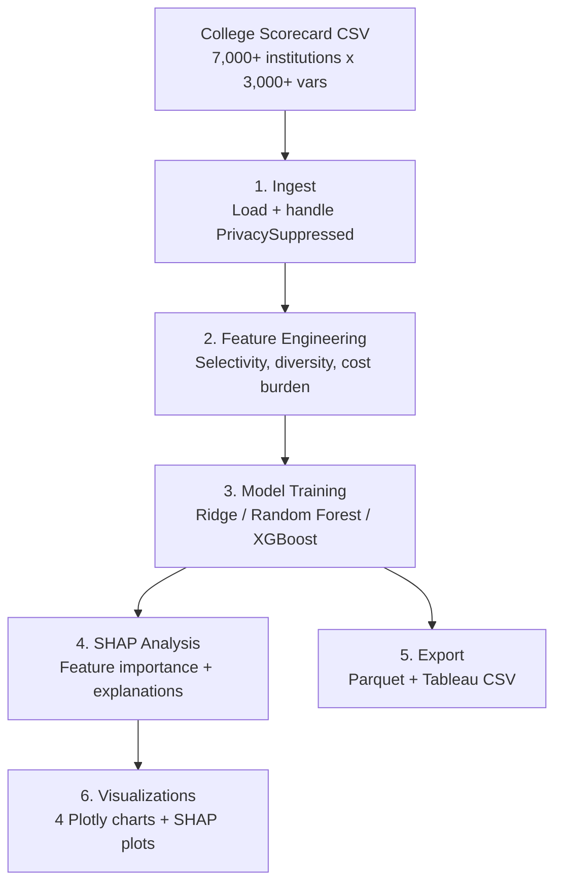

# College Scorecard Student Outcome Analytics


Predictive modeling pipeline that identifies which institutional factors most strongly predict **post-graduation earnings**, using the U.S. Department of Education's College Scorecard dataset (~7,000 institutions, 3,000+ variables).

## Architecture



## Quick Start

```bash
cd 02-college-scorecard-analytics
make setup
# Place College Scorecard CSV in data/raw/
make all
```

## License

MIT
