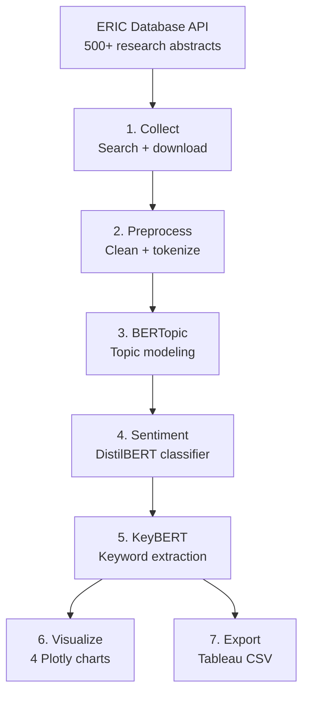

# Higher Education Policy Text Analytics


NLP pipeline for topic modeling, sentiment analysis, and keyword extraction on higher education research documents from the ERIC database (~500+ abstracts, 2018-2024).

## Architecture



## Quick Start

```bash
cd 03-higher-ed-text-analytics
make setup
make all
```

## Key Outputs
- BERTopic model with 15-25 interpretable topics
- Sentiment trends across publication years
- Topic prevalence heatmap over time
- Keyword extraction per document
- Tableau ready CSV export

## License

MIT
