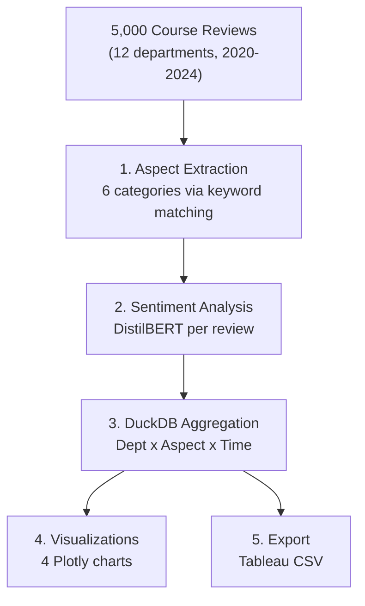

# Course Review Sentiment Dashboard


Aspect level sentiment analysis pipeline for higher education course reviews. Extracts sentiments for specific aspects (teaching quality, workload, grading, engagement) and aggregates results with DuckDB for interactive dashboards.

## Architecture



## Quick Start

```bash
cd 04-course-sentiment-dashboard
make setup
make all
```

## Key Outputs
- Aspect level sentiment (teaching, content, workload, grading, accessibility, engagement)
- Department x Aspect heatmap
- Temporal sentiment trends
- Rating vs sentiment alignment analysis

## License

MIT
